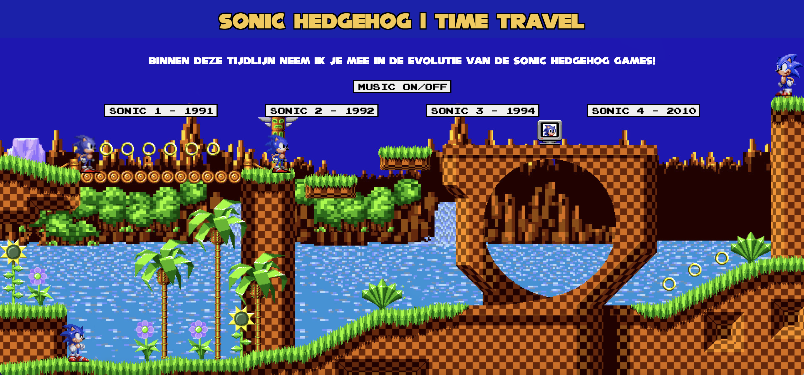
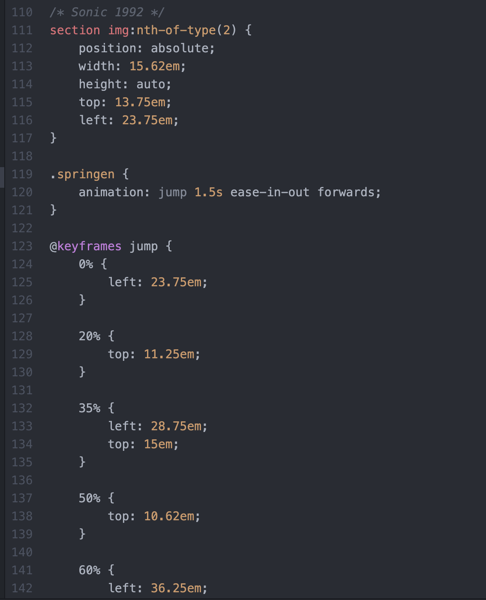
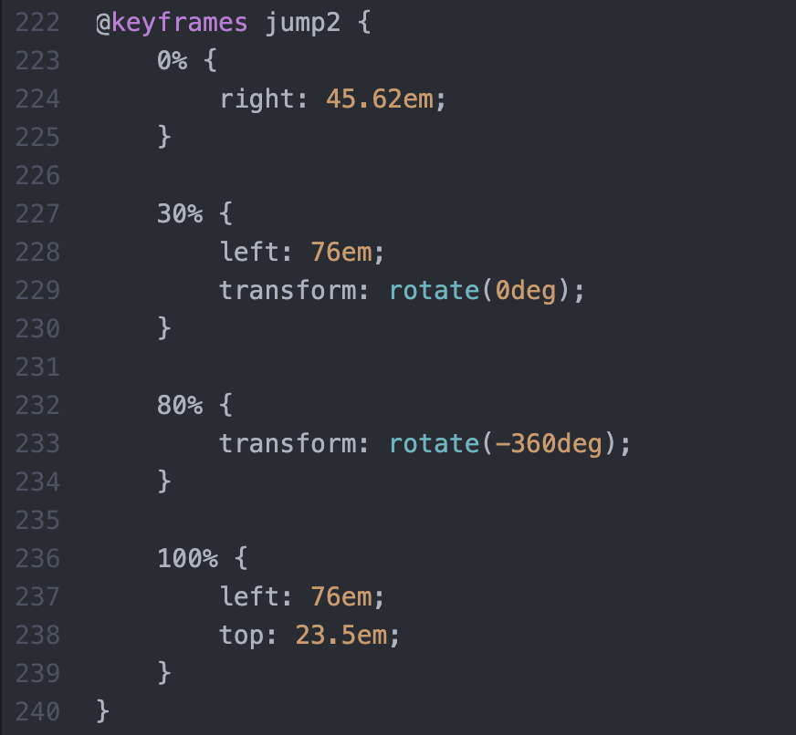
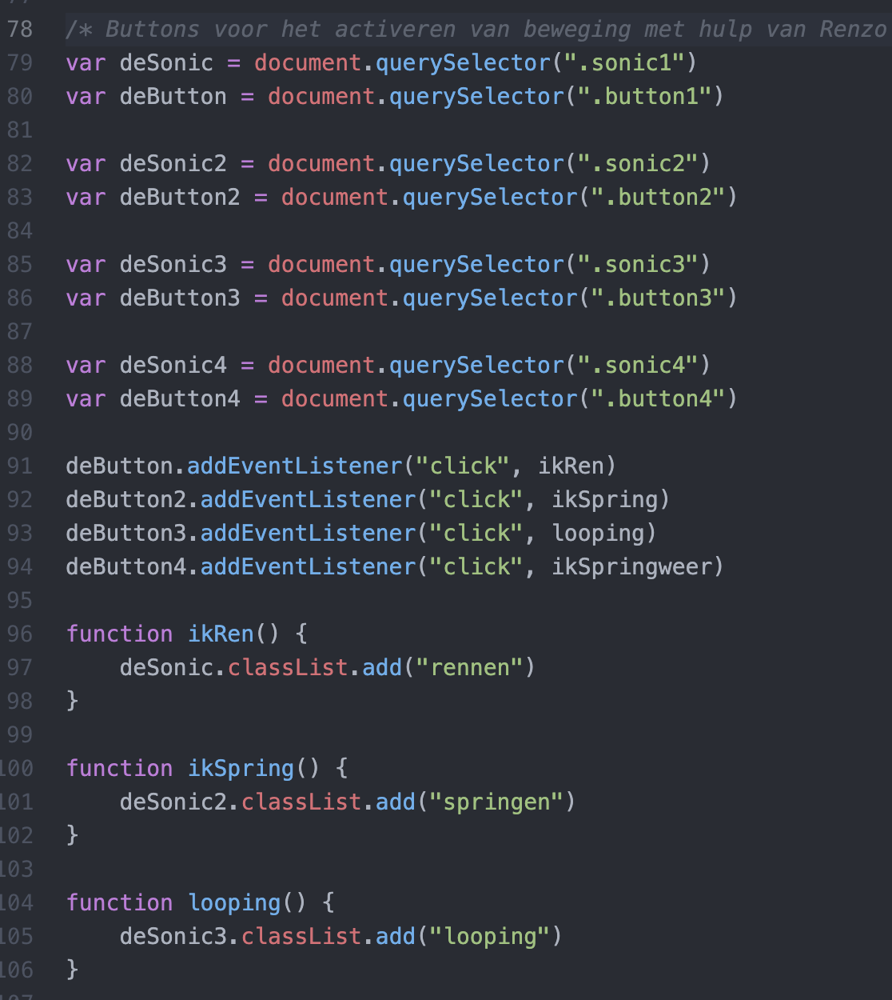

# Procesverslag

## Jij

### Ontwerper:
Luuk van den Bor

#### Je startniveau:
Mijn startniveau is: Blauw

# Je plan

  
De eerste versie/schets van je ontwerp & je persoonlijke uitdaging

  ### De eerste versie/schets:
  

  

  Mijn persoonlijke uitdaging binnen dit vak is om er voor te zorgen dat ik met behulp van code, de 4 verschillende Hedgehog games van Sonic kan laten bewegen.

  ### Je ambitie:
  Aan deze technieken/punten wil ik werken:
  - Animeren met CSS
  - Overgangen goed laten vloeien
  - Elementen kunnen positioneren

## Voortgang/Feedback 1

### Bevinding 1:
Je kan een beginscherm toevoegen om het een game effect te geven.

#### oplossing:
Omdat ik alles in 1 overzicht wil plaatsen heb ik ervoor gezorgd dat alle HTML elementen gestyled zijn naar de Sonic games huisstijl waardoor het in het geheel als een Sonic game lijkt.

### Bevinding 2:
Je kan die loopingen goed gebruiken voor tijdsverandering

#### oplossing:
De schetsen die ik heb gemaakt waren iets te ver boven mijn niveau dus heb ik ervoor gekozen om de tijdsveranderingen te laten zien met ondersteuning van buttons.

### Bevinding 3:
Misschien kan je de achtergrond veranderen met CSS

#### oplossing:
Hiervoor heb ik 1 grote afbeelding gebruikt van de eerste Hedgehog game. Deze ga ik photoshoppen (retoucheren) zodat ik er elementen aan kan toevoegen waardoor het 1 geheel wordt.

## Voortgang/Feedback 2

### Verzorging
- Elementen zijn netjes uitgelijnd - Ja
- Pagina is een beetje responsive - Ja (niet heel erg)
- Afbeeldingen hebben originele verhouding - Ja
- Afbeeldingen hebben goede kwaliteit - Ja
- Afbeeldingen en Icons vormen geheel - Nee (bepaalde elementen moeten nog gestyled worden)
- Het gebruikte kleurpalet vormt 1 geheel - Ja
- Teksten hebben voldoende contrast met achtergrond - Nee (moet nog met schaduwen gewerkt worden voor h1)
- Fonts worden correct getoond op Github - Nee (moet nog naar woff geconvert worden)

### Bediening en States
- Interactieve elementen (links,buttons) kunnen met het toetsenbord geselecteerd worden - Ja (tab)
- States passen bij het ontwerp - Nee (zijn geen hovers)

### Semantische Code
- Voor content zijn passende elemtenten gebruikt - Ja
- Voor structuur zijn passende elementen gebruikt - Ja (even kijken of ze goed staan)
- In html worden geen onnodige wrappers gebruikt - Ja

### Nette Code
- De bestandsstructuur van de webpagina is netjes - Ja
- HTML en CSS en JS zijn netjes ingesprongen - Nee (even goed controleren)
- In de code is commentaar toegevoegd als uitleg - Nee (nog niet overal)
- De overall structuur van de CSS is logisch - Ja
- De CSS properties binnen selectors staan in dezelfde volgorde - Geen idee
- CSS custom properties worden gebruikt voor alles met kleur - Ja
- Naamgeving van classes etc staan goed - Ja (dubbelcheck)
- In de CSS wordt code maar 1 keer geschreven - Nee (even goed controleren bij alles)
- Bronnen zijn opgenomen in readme en code - Ja

## Voortgang/Feedback 3

### Bevinding 1:
Probeer de verschillende Sonics allemaal een andere animatie te laten uitvoeren zodat er onderscheid is tussen de sonics.

#### oplossing:
Voor ieder jaar van Sonic heb ik een ander soort animatie toegevoegd die uniek is voor de sonic uit dat jaar.

### Bevinding 2:
Misschien kan je wat meer onderscheid maken met je fonts om meer hierarchy te creeeren.

#### oplossing:
Ander font toegevoegd voor de buttons die ook gebruikt wordt bij de echte Hedgehog games van Sonic.

### Bevinding 3:
Je kan geluiden bij de sonic animaties plaatsen als toevoeging

#### oplossing:
Geluiden set gedownload van het internet en de juiste toegevoegd per actie die wordt uitgevoerd per button.

## Reflectie

  
Mijn eindresultaat & persoonlijke ontwikkeling

### Je uitkomst - karakteristiek screenshot(s):
  

### Dit ging goed/Heb ik geleerd:
  Korte omschrijving met plaatje(s)

  Het gene wat boven mijn verwachting goed ging was het inzetten van de verschillende animaties binnen CSS. Hierbinnen heb ik me kunnen ontwikkelen met positionering en beweging wat bij heeft gedragen aan het eindresultaat.

  

  

### Dit was lastig/Is niet gelukt:
  Korte omschrijving met plaatje(s)

  Wat ontzettend lastig was voor mij was het inzetten van Javascript. Om het concept makkelijk te maken wilde ik mijn animaties aansturen via buttons. Hier kwam natuurlijk Javascript bij kijken. Eerst heb ik zelf geprobeerd om er wat van te maken omdat ik de opbouw redelijk begrijp (variabelen en fucties etc.). Het ging alleen ontzettend mis met hele kleine foutjes die ik maakte waaroor ik hier heel veel tijd aan kwijt ben geweest. Uiteindelijk hebben Tom en Renzo me goed kunnen helpen met het Javascript gedeelte en heb ik daarna zelf een paar buttons kunnen activeren.

  

## Feedback voor herkansing
- Ontwerp aanpassen
- Progressive Disclosure toevoegen
- Achtergronden laten veranderen
- Notities goed toevoegen voor overzicht
- 1 class of ID per element gebruiken
- Header en main goed positioneren
- Lists (orderd lists) gebruiken voor sonics en buttons
- Alts altijd toevoegen aan html elementen (screenreaders)
- Start scherm gebruiken
- Github testen of url werkt voor inleveren
- Button states toevoegen (hover, active, focus)

## Reflectie na Feedback/herkansing
Heftig. Dat is het eerste woord wat er in me opkomt als ik kijk naar de afgelopen week. Doordat ik veel punten heb moeten aanpassen, begon ik tegen veel obstakels aan te lopen. Het grootste obstakel was de geluiden bij de buttons houden. Omdat ik de geluiden zonder class of ID moet aanroepen kostte dit veel tijd. Het laten veranderen van de achtergronden met behulp van de buttons (javascript) kostte ook ontzettend veel tijd. Dit was uiteindelijk wel gelukt, wat eindelijk voor een beetje opluchting heeft gezorgd. Daarna ben ik bezig geweest met de buttons states toevoegen, keyframe animaties aanpassen, ol’s toevoegen in html en alle elementen weer goed te positioneren. Na veel vallen en opstaan ben ik tot het eindresultaat gekomen. Het is visueel iets minder sterk dan ik in mijn hoofd had. Maar dat komt waarschijnlijk doordat mijn programmeer skills toch iets lager liggen dan mijn ontwerp skills.

## Bronnenlijst

continu bijhouden terwijl je werkt

Nb. Wees specifiek ('css-tricks' als bron is bijv. niet specifiek genoeg).

1. https://www.fontsquirrel.com/tools/webfont-generator
2. https://www.w3schools.com/jsref/met_audio_play.asp
3. https://archive.org/details/SonictheHedgehogGEN
4. https://www.findsounds.com/ISAPI/search.dll?keywords=sonic+hedgehog
5. DLO Slides voor bijvoorbeeld positionering/styling/fonts
6. Renzo heeft me geholpen met het stukje Javascript om de buttons te linken met de css animaties.
7. Tom heeft me geholpen met de geluiden in Javascript te linken.

